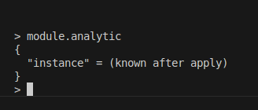
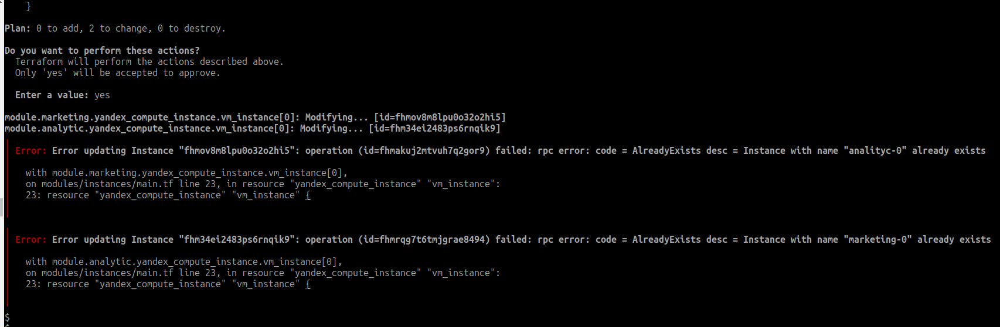
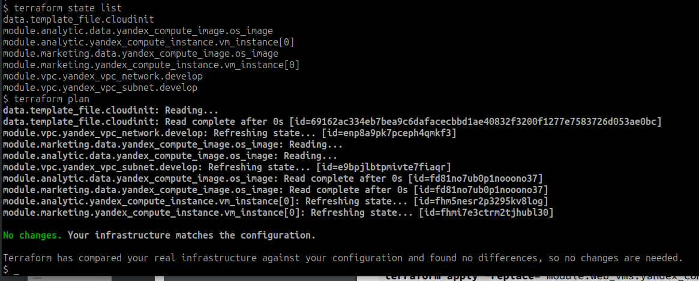
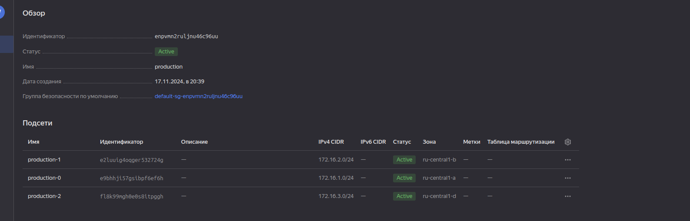
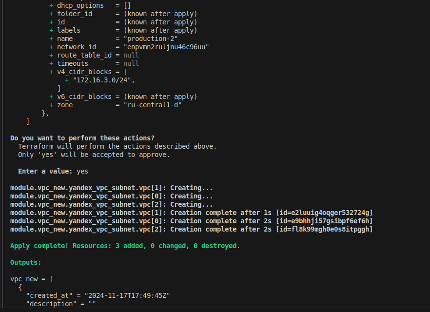

## 

### Задание 1




### Задание 2

[vpc doc.md](./04/src/modules/vpc/doc.md)

### Задание 3

1. ``` terraform state list```


2. remote vpc


3. 


4.


тут я не понял почему предлагает изменить labels и name


```terraform apply``` (


удалил и создал по новой 

```sh

$ terraform destroy -target="module.marketing.yandex_compute_instance.vm_instance[0]"
$ terraform destroy -target="module.analytic.yandex_compute_instance.vm_instance[0]"
$ terraform plan
$ terraform apply
```


### Задание 4

root:main.tf
```rb
module "vpc_new" {
  source = "./modules/vpc_new"
  env_name = "production"
  token = var.token
  cloud_id = var.cloud_id
  folder_id = var.folder_id
  subnets = [
    { zone = "ru-central1-a", cidr = "172.16.1.0/24" },
    { zone = "ru-central1-b", cidr = "172.16.2.0/24" },
    { zone = "ru-central1-d", cidr = "172.16.3.0/24" },
  ]
}
```

module:

 - ```main.tf```
```rb
resource "yandex_vpc_network" "vpc" {
  name = var.env_name
}
resource "yandex_vpc_subnet" "vpc" {
  count = length(var.subnets)
  name           = "${var.env_name}-${count.index}"
  zone           = "${var.subnets[count.index].zone}"
  network_id     = yandex_vpc_network.vpc.id
  v4_cidr_blocks = ["${var.subnets[count.index].cidr}"]
}
```

- ```variables.tf```
```rb
variable "env_name" {
  type        = string
  default     = "develop"
  description = "VPC network&subnet name"
}

variable "subnets" {
  type = list(map(string))
  default = [ { "zone" = "ru-central1-a", "cidr" = "172.16.1.0/24" } ]
}
```

- ```outputs.tf```
```rb
output "vpc_subnet" {
  value = yandex_vpc_subnet.vpc
}
```




```sh
$ terraform state list
data.template_file.cloudinit
module.analytic.data.yandex_compute_image.os_image
module.analytic.yandex_compute_instance.vm_instance[0]
module.marketing.data.yandex_compute_image.os_image
module.marketing.yandex_compute_instance.vm_instance[0]
module.vpc.yandex_vpc_network.develop
module.vpc.yandex_vpc_subnet.develop
module.vpc_new.yandex_vpc_network.vpc
module.vpc_new.yandex_vpc_subnet.vpc[0]
module.vpc_new.yandex_vpc_subnet.vpc[1]
module.vpc_new.yandex_vpc_subnet.vpc[2]
$ 
```

