## 

### Задание 1

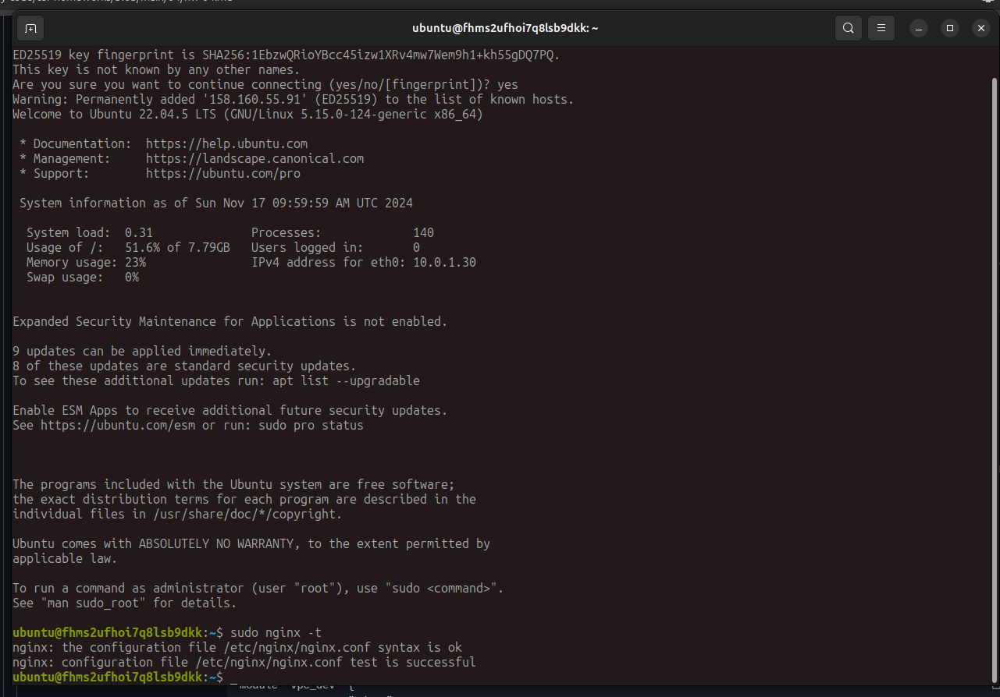

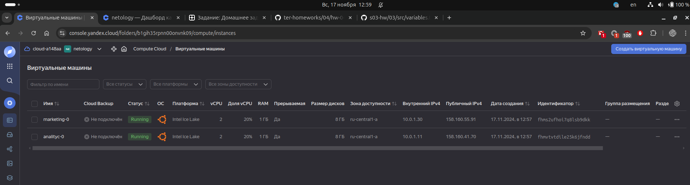

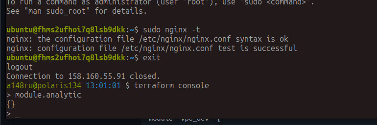

### Задание 2

[vpc doc.md](./04/src/modules/vpc/doc.md)

### Задание 3

1. ``` terraform state list```

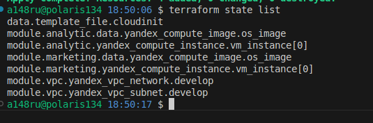

2. remote vpc

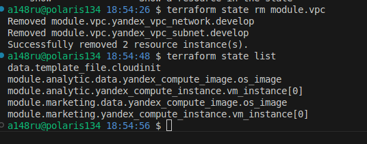

3. 


4.

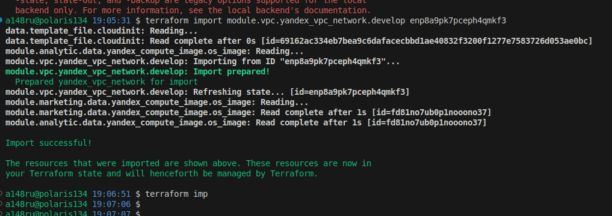
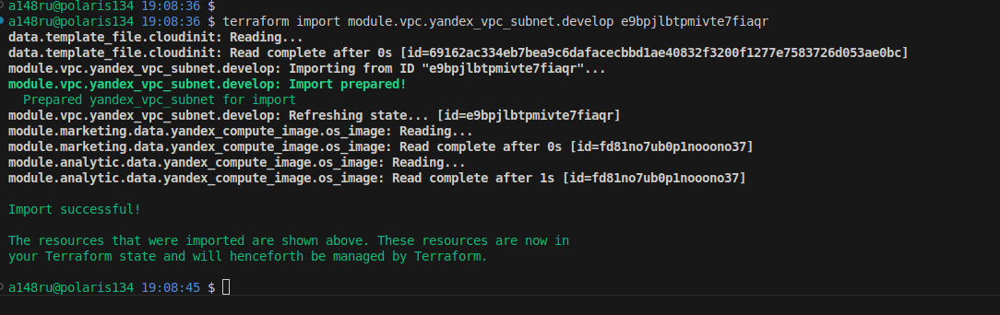
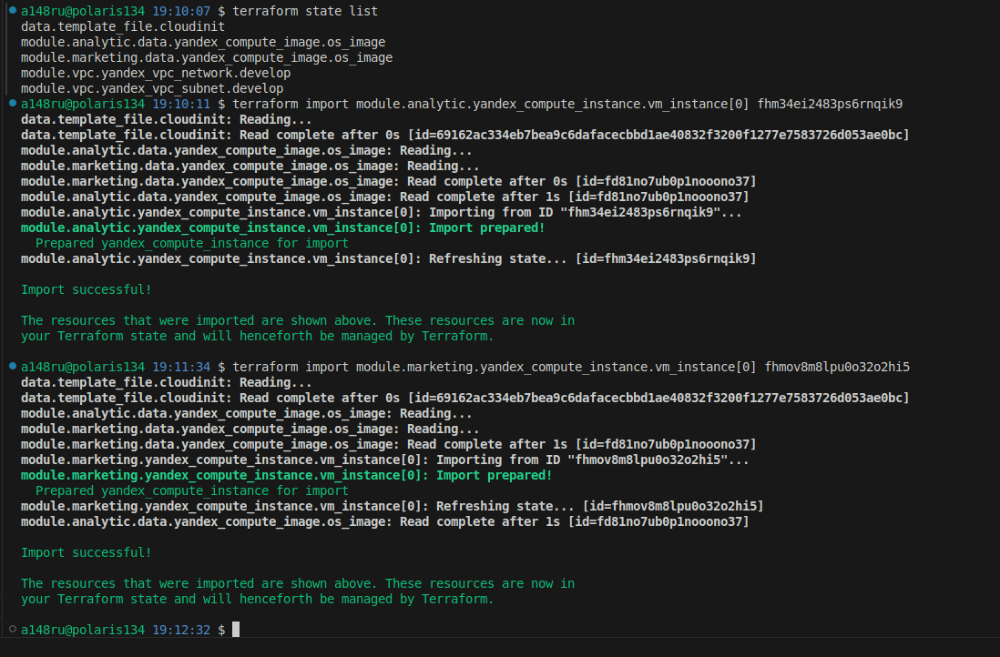

тут я не понял почему предлагает изменить labels и name

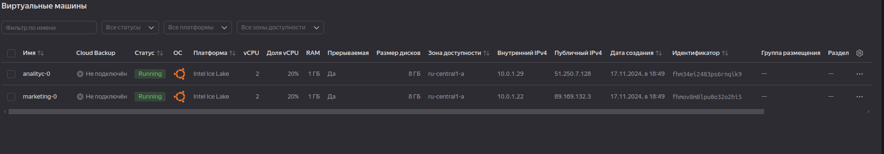

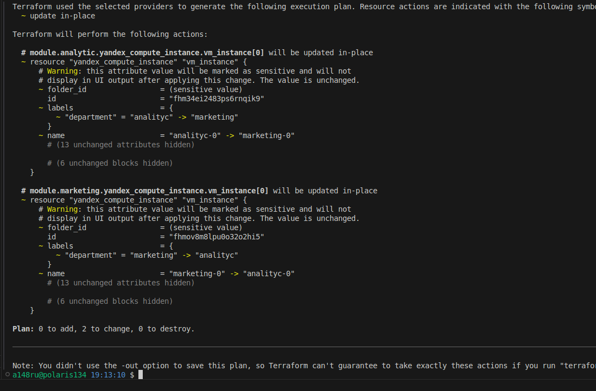

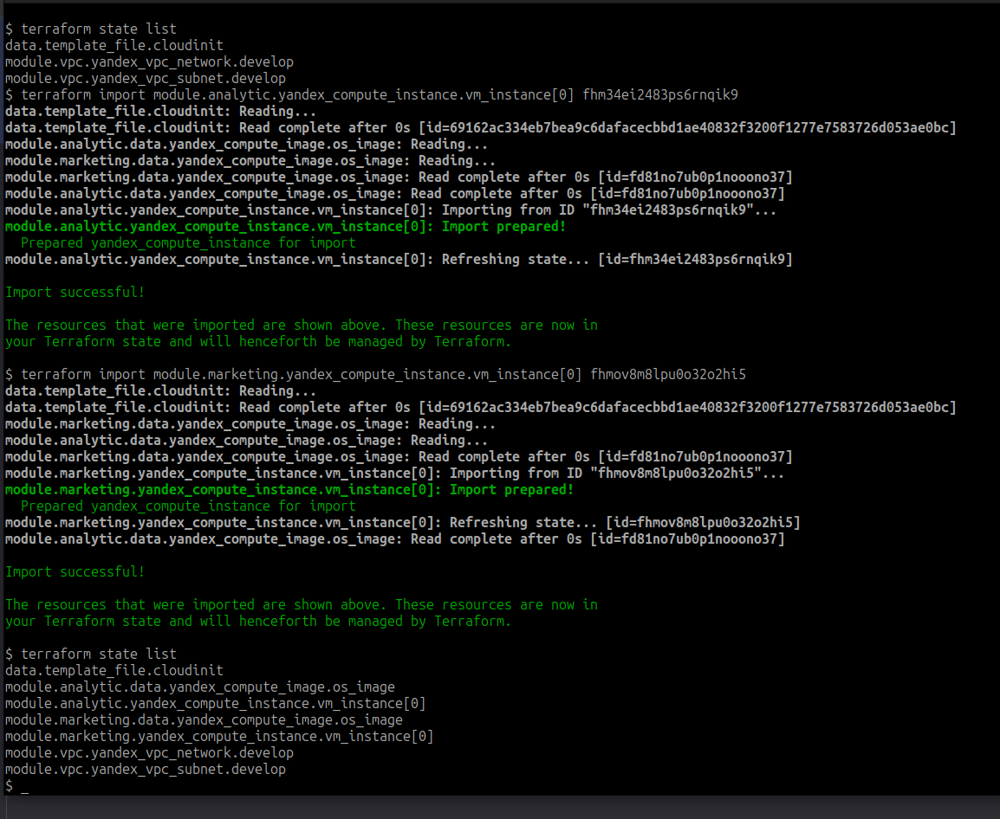

### Задание 4
