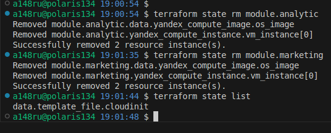

## 

### Задание 1


### Задание 2

[vpc doc.md](./04/src/modules/vpc/doc.md)

### Задание 3

1. ``` terraform state list```


2. remote vpc


3. 



4.


тут я не понял почему предлагает изменить labels и name


### Задание 4
